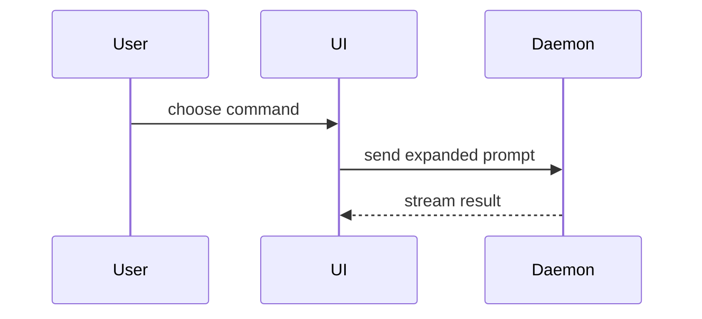

This skill owns the **structure** of a PR body. `no-ai-slop` owns the **voice**: call the Skill tool with `no-ai-slop` before you write. Use the domain terms from `GLOSSARY.md`.

Read the governing spec, plan, or ticket as well as the diff, to tell whether the change is a one-way door.

The repo's own PR template wins (`.github/pull_request_template.md`, `.gitlab/merge_request_templates/`, `docs/pull_request_template.md`, `PULL_REQUEST_TEMPLATE.md`). Fill every section and checkbox it has. Put the Summary visual, the Evidence, and the Merge Danger below into its closest sections, and add a section only for what it has no place for.

## Template

```markdown
## Summary

<ticket or plan link>

<diagram, diff sketch, or tree>

## Evidence

- **Before:** <screenshot / output / failing test run>
  **After:** <screenshot / output / passing test run>

## Merge danger

**Door:** <one-way or two-way>

<optional: why>

**Blast radius:** <short phrase>

<optional: what could break on merge>
```

Start the body at the Summary heading.

## Summary

Pick the smallest view that makes the key point clear.

- Logic or an algorithm as pseudocode:

```text
on(save)
  if content is unchanged
    return cached result
  write new content
  return fresh result
```

- Runtime control flow as a call tree:

```text
submitForm
  createSession
    persistPrompt
    launchAgent
  navigateToSession
```

- UI structure as a component tree, with the state and module boundaries that matter:

```text
<SessionPage> (apps/example/src/routes/session.tsx)
  useSessionEvents()
  <SessionToolbar>
    <RunSkillButton> (packages/ui)
```

- File responsibility or a broad refactor as a shallow file tree:

```text
src/
├── commands/       # parses user actions
├── sessions/       # owns session state
└── transport/      # sends API requests
```

- Interaction or data flow between components as Mermaid, on GitHub and GitLab only. Bitbucket shows Mermaid as a raw code block, so there use a call tree or an arrow list (`UI -> Daemon: send prompt`).



- `diff` when the point is what changes and the surrounding shape already exists. Match the diff to the topic:

```diff
 <SessionPage>
   useSessionEvents()
   <SessionToolbar>
+    <RunSkillButton />
   <SessionTimeline>
+    <SkillResultCard />
```

```diff
 src/
 ├── commands/
+│   └── show-me.ts       # expands the slash command
 ├── sessions/
-└── transport.ts
+└── transport/
+    ├── client.ts
+    └── stream.ts
```

```diff
 submitForm
   createSession
     persistPrompt
+    expandSkillMention
     launchAgent
-  navigateToSession
+  navigateToSession
+    subscribeToEvents
```

- The new code in full, when most of it is new, when cut context would hide ownership or order, or when the reviewer needs the target shape to copy.

Put each visual next to the short text it supports. Keep only the calls, files, props, states, and boundaries the reviewer needs. One visual is usual, two is fine, more is rare.

## Evidence

Show a before and an after from runs you can point to. They come from this session or from output already in the plan, ticket, or PR. Code you read is not evidence.

- Screenshots are best for a visual change, when the environment can take them.
- Execution next: the exact test that failed and now passes, named or sketched in pseudocode, or the command and its output.

If no run is possible, say what you did not run and why. A change with nothing to run (docs, config text) states that in place of Before and After.

## Merge danger

- **Door.** A two-way door can be walked back: revert the commit and you are where you started. A one-way door is what a revert does not undo, in the repo or outside it: a migration that drops data, sent emails or events, a published API or package version, a contract or data format others start to depend on, a deleted resource.
- **Blast radius.** What breaks, and for whom, if this is wrong. One button, one service, every consumer of a library, layout on mobile. Name the widest one that is real.

Two-way and small: the reviewer can skim. One-way: say what to read slowly.

Done when every section is filled from this change, Evidence shows real before and after output or a stated reason there is nothing to run, and you ran the `no-ai-slop` pre-send checklist on the body.
