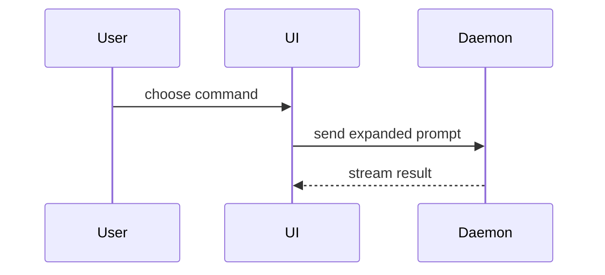

# Visuals for What changed

Pick the smallest view that makes the point. In pseudocode and flows, write each step as what it does. In call, component, and file trees the names are the content, so keep only the ones the reviewer will open.

- Behavior per case as a table, cases as rows, Before and After as columns:

```markdown
| Service answers | Before | After |
|---|---|---|
| 404 | 400 "unknown" | same |
| timeout | 400 "unknown" | 503 "could not check" |
```

- Logic or an algorithm as pseudocode:

```text
on(save)
  if content is unchanged
    return cached result
  write new content
  return fresh result
```

- Runtime control flow as a call tree. Use `diff` when the point is what changes in a shape that already exists:

```diff
 submitForm
   createSession
     persistPrompt
+    expandSkillMention
     launchAgent
   navigateToSession
+    subscribeToEvents
```

- UI structure as a component tree, with the state and module boundaries that matter:

```text
<SessionPage> (apps/example/src/routes/session.tsx)
  useSessionEvents()
  <SessionToolbar>
    <RunSkillButton> (packages/ui)
```

- File responsibility or a broad refactor as a shallow file tree:

```text
src/
├── commands/       # parses user actions
├── sessions/       # owns session state
└── transport/      # sends API requests
```

- Interaction or data flow between components as Mermaid, on GitHub and GitLab only. Bitbucket shows Mermaid as a raw code block, so there use a call tree or an arrow list (`UI -> Daemon: send prompt`).



- The new code in full, when most of it is new or the reviewer needs the target shape to copy.
- The new code in full also when a cut would hide who owns a step or the order of steps.
